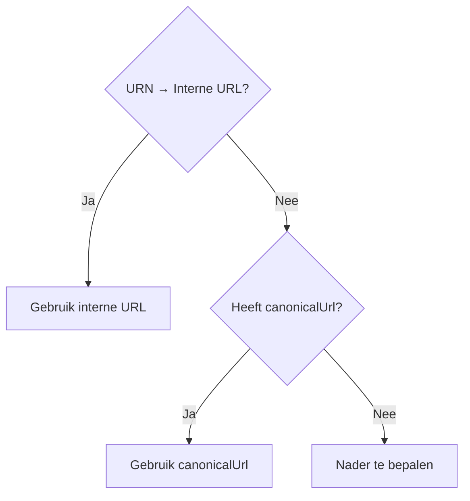

import Schema from "@theme/Schema";
import Heading from "@theme/Heading";

<Heading
  as={"h1"}
  className={"openapi__heading"}
  children={"ContextLink"}
>
</Heading>

De context waaraan de taak is gekoppeld (bijv. een zaak of product),
aangeduid met een **URN** en optioneel een **canonicalUrl**.

`canonicalUrl` is afwezig als de dienstverlener geen eigen portaal heeft
(bijv. bedrijfsonderdelen die geen eigen portaal hebben).

Portalen die de URN kunnen omzetten naar een interne URL doen dat;
`canonicalUrl` is dan irrelevant. Anders geldt: gebruik `canonicalUrl`
als die aanwezig is. Het type context is af te leiden uit de URN-structuur.

<Schema
  {...require("./contextlink.Schema.json")}
>
  
</Schema>
            