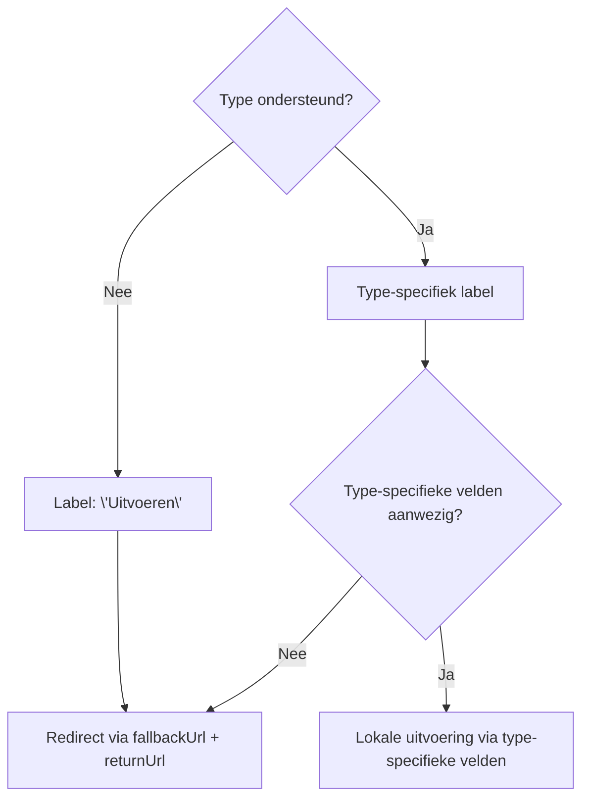

import Schema from "@theme/Schema";
import Heading from "@theme/Heading";

<Heading
  as={"h1"}
  className={"openapi__heading"}
  children={"UitvoeringInfo"}
>
</Heading>

Uitvoeringsinformatie voor een taak: hoe de actieknop gelabeld wordt
en waar de gebruiker naartoe gaat.

`fallbackUrl` is altijd aanwezig als universele fallback.

<Schema
  {...require("./uitvoeringinfo.Schema.json")}
>
  
</Schema>
            