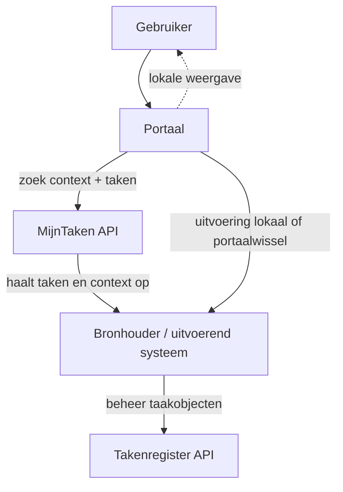

# Positionering

Deze pagina positioneert de MijnTaken API ten opzichte van de Taken API op basis van de huidige OpenAPI specificaties.

Waar hieronder wordt gesproken over ontwerpintentie, is onderscheid gemaakt tussen:

- wat expliciet in de aangeleverde specificaties staat
- wat daaruit functioneel kan worden afgeleid

Dat onderscheid is bewust gemaakt om feitelijke vaststellingen uit de specificaties te scheiden van interpretatie. Waar een uitspraak een duiding is en niet letterlijk in de spec staat, is dat hieronder vermeld.

Waar in dit document over een **portaal** wordt gesproken, kan functioneel vaak ook een **app** worden gelezen: het gaat om het kanaal waarmee een eindgebruiker informatie raadpleegt en acties uitvoert. De aangeleverde MijnTaken-specificatie gebruikt zelf vooral de term `portaal`.

## Samenvatting

De twee API's liggen inhoudelijk dicht genoeg bij elkaar om vergelijkbaar te zijn, maar vertrekken vanuit een ander contractdoel.

- De **MijnTaken API** is primair een **interactiecontract voor portalen en apps**: een kanaal vraagt voor een eindgebruiker taken en context op, en gebruikt die informatie om een overzicht, taakkaart of contextscherm op te bouwen.
- De **Taken API** is primair een **taakregister en beheer-API**: systemen maken taken aan, werken ze bij, verwijderen ze en lezen ze terug per taaksoort.

Uit de MijnTaken-spec is daarnaast af te leiden dat de API is opgezet als een **kern met uitbreidingssets**: taken zijn het eerste ondersteunde resource-type en andere typen kunnen later worden toegevoegd. Op basis daarvan laat de API zich lezen als een eerste concrete invulling van een bredere interactieservices-gedachte. Die term komt in de aangeleverde specificaties niet letterlijk voor en is dus een functionele duiding.

Het accent van de MijnTaken API ligt daardoor op **buiten-naar-binnen**: een portaal of app aan de voorkant brengt in een overheidsbrede context gegevens en acties uit meerdere bronnen bijeen zonder de uitvoering over te nemen. De Taken API gaat uit van een **register van taakobjecten** van een bepaald type, met CRUD-operaties per taaksoort.

## Waarom nog een API?

De vraag "waarom nog een API?" is terecht als twee specificaties allebei over taken gaan. Op basis van de aangeleverde specificaties lijkt het antwoord vooral te liggen in een **ander contractdoel** en een **andere gebruikssituatie**.

De Taken API beschrijft een generiek taakmodel met collecties en beheeroperaties per taaksoort. Dat past bij een register- of beheersituatie: taken bestaan als resources die systemen kunnen aanmaken, wijzigen, verwijderen en opvragen.

De MijnTaken API beschrijft een interactiecontract voor portalen en apps. Het vertrekpunt is niet het beheren van taakobjecten, maar het tonen van taken en context aan een eindgebruiker, met expliciete ruimte voor lokale uitvoering, portaalwissel en uitbreiding naar andere resource-typen.

Daarmee hoeft MijnTaken niet gelezen te worden als vervanging van de Taken API. De specificaties laten eerder ruimte voor een aanvullende rolverdeling:

- de **Taken API** als register- of beheercontract
- de **MijnTaken API** als contract voor portalen, apps en interactie

Dat onderscheid is relevant, omdat een register maken iets anders is dan een portaal of app in staat stellen om informatie en acties uit meerdere bronnen in samenhang aan de gebruiker te tonen.

## Hoofdverschillen

### 1. Vertrekpunt van het contract

De MijnTaken API vertrekt vanuit de vraag: _welke informatie en taken moet een portaal of app voor deze gebruiker in deze context tonen?_ Dat zie je terug in `POST /context/zoek` en in het samengestelde `ContextResultaat`.

De Taken API vertrekt vanuit de vraag: _welke taakobjecten bestaan er in dit register, en hoe beheer ik die?_ Dat zie je terug in afzonderlijke collecties zoals `GET/POST /externetaken`, `GET/POST /betaaltaken`, `GET/POST /formuliertaken` en `GET/POST /urltaken`, plus `PUT`, `PATCH` en `DELETE` op individuele taken.

### 2. Buiten-naar-binnen versus registergericht

Voor overheidsbrede portalen en apps is de MijnTaken API buiten-naar-binnen opgezet. Een portaal of app haalt taken op uit de omgeving van de bronhouder en bepaalt vervolgens hoe de gebruiker verder gaat:

- lokaal tonen in een lijst of contextscherm
- lokaal uitvoeren als het portaal dat type uitvoering ondersteunt
- anders doorsturen naar de bron via een canonical URL of fallback-URL

De Taken API modelleert taken meer als zelfstandige resources in een register. Dat is generieker, maar legt het zwaartepunt minder op het portaal als samenbrengend kanaal en meer op het beheren van taken als domeinobject.

### 3. Context als eerste concept

In de MijnTaken API is context een kernbegrip. Taken kunnen worden opgevraagd binnen een specifieke context via `contextId`, en een taak verwijst terug naar context via een `ContextLink` met URN en optionele `canonicalUrl`.

Daardoor past het contract goed bij portaal-schermen zoals:

- een algemene takenlijst
- taken binnen een zaakcontext
- een portaal dat contextlinks intern kan resolveren

In de Taken API is relatie naar andere objecten wel aanwezig, bijvoorbeeld via `isGerelateerdAan`, maar niet als primair interactiemodel voor het ophalen van een samengesteld portaalbeeld.

### 4. Samengestelde respons versus typecollecties

De MijnTaken API gebruikt een samengesteld antwoordmodel. `POST /context/zoek` levert een `ContextResultaat` op met resource-typen die via `include` worden opgevraagd. Vandaag zit daar vooral `taken` in, maar het contract is expliciet opgezet om later ook andere typen toe te voegen.

De Taken API groepeert per taaksoort in aparte collecties. Dat maakt het model expliciet en beheersbaar, maar laat minder nadruk zien op een generiek portaalcontract dat op termijn ook andere klantgerelateerde resource-typen in hetzelfde patroon wil opnemen.

Dit punt is in de MijnTaken-spec expliciet verwoord: de API is opgezet als een **kern met uitbreidingssets**, waarbij `taken` initieel wordt ondersteund en andere resource-typen later toegevoegd kunnen worden. In de aangeleverde Taken API-spec is geen vergelijkbaar extensiemodel op API-niveau beschreven; daar is de structuur juist uitgewerkt als een verzameling aparte taakcollecties.

### 5. Lezen en uitvoeren versus beheren

De MijnTaken API bevat alleen het portaalgerichte minimum:

- een zoekoperatie voor overzichten en contextschermen
- een detailoperatie voor het vlak voor uitvoering ophalen van een taak

Dat sluit aan bij het uitgangspunt **uitvoering bij de bron**: het portaal raadpleegt en rendert, maar wordt geen taakregister.

De Taken API ondersteunt nadrukkelijk ook het beheer van taken door systemen:

- aanmaken
- volledig wijzigen
- gedeeltelijk wijzigen
- verwijderen

Dat positioneert de Taken API meer als generieke intersysteem-API voor taakregistratie dan als dun contract tussen portaal en bronhouder.

### 6. Typemodel en groeipad

De Taken API werkt met expliciete taaksoorten en aparte resources daarvoor. Dat is helder, maar in de aangeleverde spec wordt geen expliciet groeipad voor portalen of afnemers beschreven. Wat wel hard zichtbaar is, is dat de API uitgaat van aparte collecties en beheeroperaties per taaksoort.

De MijnTaken API kiest voor een additief portaalmodel:

- onbekende velden moeten genegeerd kunnen worden
- nieuwe resource-typen kunnen aan `include` en de respons worden toegevoegd
- onbekende uitvoeringstypen vallen terug op generiek gedrag

Dat groeipad is vooral geoptimaliseerd voor portalen en bronhouders die onafhankelijk van elkaar evolueren. Dat staat ook expliciet in de MijnTaken-spec en de bijbehorende documentatie: portalen en providers mogen onafhankelijk groeien, onbekende velden moeten genegeerd worden, en nieuwe resource-typen of uitvoeringstypen mogen worden toegevoegd zonder bestaande implementaties te breken.

Voor de Taken API is een vergelijkbare conclusie op basis van de aangeleverde spec niet hard te trekken. De spec laat wel een stabieler registerachtig model zien, maar zegt niet expliciet dat dit ook de beoogde compatibiliteitsstrategie is. Dat blijft dus een duiding, geen bewezen ontwerpeis uit de specificatie.

### 7. Backward en forward compatibility

Hier is ook een expliciet verifieerbaar verschil zichtbaar.

De MijnTaken API formuleert backward en forward compatibility expliciet als ontwerpprincipe. In de spec staat onder meer dat:

- een oudere portal correct moet blijven werken met een nieuwere provider
- een huidig portaal onbekende velden van een toekomstige provider moet negeren
- providers geen velden mogen verwijderen, hernoemen of nieuwe verplichte request-parameters mogen introduceren
- het contract het Robustness principle volgt

Die compatibiliteitsfilosofie is bovendien doorvertaald naar concrete ontwerpkeuzes:

- extensible enums in plaats van gesloten enums
- een open `include`-lijst
- samengestelde responses waarin resource-typen kunnen worden toegevoegd
- fallbackgedrag bij onbekende uitvoeringstypen

In de aangeleverde Taken API-spec is zo'n expliciete backward/forward-compatibiliteitsparagraaf niet aangetroffen. Ook is daar geen vergelijkbare normatieve tekst gevonden over het negeren van onbekende velden, open uitbreidbare lijsten of een additief portaalmodel.

Dat betekent niet automatisch dat de Taken API niet compatibel ontworpen is, maar wel dat die ontwerpfilosofie in de aangeleverde specificatie niet expliciet is uitgewerkt als afzonderlijk ontwerpprincipe, terwijl dat bij MijnTaken wel het geval is.

## Wanneer komt MijnTaken in beeld?

Uit de vergelijking volgt dat MijnTaken vooral in beeld komt in situaties waarin naast een takenregister ook behoefte bestaat aan een interactiecontract voor eindgebruikerskanalen. Dat is bijvoorbeeld het geval wanneer:

- een overheidsportaal taken wil tonen in samenhang met zaken of andere contextobjecten
- taken vanuit meerdere bronhouders in één portaalbeeld samenkomen
- portaalwissel mogelijk moet blijven, maar niet het enige interactiemodel mag zijn
- lokale uitvoering mogelijk moet zijn zonder dat het portaal systeemeigen taakbeheer overneemt
- het contract voorbereid moet zijn op uitbreiding naar andere resource-typen dan alleen taken

De gemeentelijke context is daarin een belangrijk voorbeeld, maar niet de enige beoogde toepassing.

De Taken API blijft daarbij een relevante verwante standaard: zij beschrijft een generieker taakmodel en kan goed passen in situaties waar een centraal of logisch taakregister het vertrekpunt is.

## Architectuurschets voor overheidsbrede interactie

Onderstaand plaatje laat het onderscheid zien voor overheidsbrede interactie: MijnTaken zet het portaal en de contextschermen centraal, terwijl de uitvoering en bronlogica bij de bronhouder blijven.

In deze schets is de Taken API niet hetzelfde als de MijnTaken API, maar eerder een mogelijk register- of beheerpatroon achter de schermen. De MijnTaken API zit dichter op de interactie tussen portaal en bronhouder.

## Conclusie

De specificaties laten zien dat de Taken API en de MijnTaken API een verschillend primair doel hebben. De Taken API richt zich op taakbeheer in een register, terwijl de MijnTaken API is uitgewerkt als interactiecontract voor portalen en apps.

Daarnaast benoemt de MijnTaken-specificatie compatibiliteit en uitbreidbaarheid expliciet als ontwerpprincipe. In de aangeleverde Taken API-specificatie is dat niet als afzonderlijk ontwerpprincipe uitgewerkt.
