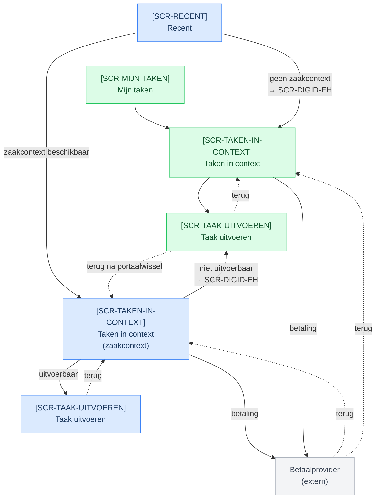

import BpmnViewer from '@site/src/components/BpmnViewer';

# Procesoverzicht

Het onderstaande diagram toont de hoofdflow van het MijnTaken-proces op hoog niveau, met swimlanes voor MijnOverheid en het lokale portaal.

:::note[In ontwikkeling]
Dit diagram toont alleen de hoofdflow. Exception flows (zoals een mislukte betaling, een ingetrokken taak of het verlopen van een termijn) zijn nog niet uitgewerkt.
:::

<BpmnViewer url="/FlowchartMijnTaken.bpmn" height="30vh" />

## Schermflow

Het onderstaande diagram toont de navigatieflow langs de [schermen](./schermen/index.md) per startpunt en taaktype. **Blauw** is het beoogde pad voor MijnOverheid, **groen** voor MijnOmgeving. De betaalprovider (grijs) is extern en bereikbaar vanuit beide portalen.

:::note[Eerste versie]
Dit diagram is een eerste schets en wordt bijgehouden naarmate schermen en taaktypen zich ontwikkelen.
:::
