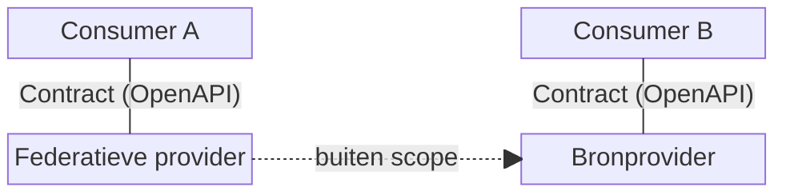

# Uitgangspunten

:::warning[In ontwikkeling]
Dit document is nog in ontwikkeling en kan wijzigen.
:::

De MijnTaken API standaardiseert hoe portalen taken tonen en uitvoeren namens hun gebruikers. Het doel: een gebruiker kan een taak oppakken op elk aangesloten portaal, ongeacht welke organisatie de taak heeft uitgezet — vergelijkbaar met hoe je met je telefoon in het buitenland belt via een ander netwerk, zonder dat je iets hoeft in te stellen.

## Rollen

De systemen die deelnemen aan het netwerk vervullen een van drie rollen:

| Rol                      | Omschrijving                                                                                                                                                                |
| ------------------------ | --------------------------------------------------------------------------------------------------------------------------------------------------------------------------- |
| **Consumer**             | Een portaal dat de API afneemt en taken toont aan eindgebruikers, zoals mijn.overheid.nl of een gemeentelijk portaal.                                                       |
| **Bronprovider**         | Het systeem dat de taken beheert en de API aanbiedt.                                                                                                                        |
| **Federatieve provider** | Een tussenprovider die de API aanbiedt aan consumers, maar de data ophaalt bij een of meer bronproviders. Gedraagt zich naar de consumer toe identiek aan een bronprovider. |

Hoe een federatieve provider communiceert met bronproviders valt buiten de scope van dit contract. Hetzelfde geldt voor identificatie en authenticatie van eindgebruikers — die worden afgehandeld door een externe identity provider (zoals DigiD of eHerkenning).

## Principes

### 1. Uniform contract

Het maakt voor een consumer niet uit of deze communiceert met een bronprovider of een federatieve provider. Beide implementeren dezelfde interface: dezelfde endpoints, dezelfde responsestructuur, hetzelfde gedrag. Er zijn geen clausules in het contract die onderscheid maken op basis van de positie in het netwerk.

### 2. Forward en backward compatibility

Consumers en providers moeten onafhankelijk van elkaar kunnen evolueren. Het contract is daarom uitbreidbaar zonder bestaande implementaties te breken:

- **Backward compatible** — een oudere consumer werkt correct met een nieuwere provider die extra velden toevoegt.
- **Forward compatible** — een nieuwere consumer kan nieuwe velden benutten als ze aanwezig zijn, zonder dat ze verplicht zijn.

Dit volgt het [Robustness principle](https://en.wikipedia.org/wiki/Robustness_principle): wees conservatief in wat je stuurt, liberaal in wat je accepteert.

### 3. Uitvoering bij de bron

Een taak wordt altijd uitgevoerd bij de bronprovider — al dan niet via een federatieve provider als doorgeefluik. Consumers tonen de taak, maar slaan geen uitvoeringsdata op. Dit borgt dataminimalisatie: uitvoeringsdata verlaat de bronprovider niet structureel.

## Uitwerking

### Additief model en groeipad

Compatibility wordt gerealiseerd via een additief model: de response bevat alle beschikbare velden, en de consumer gebruikt wat het ondersteunt. Er is geen handshake vooraf waarbij capabilities worden uitgewisseld. Consumers gaan robuust om met onbekende velden en vallen terug op een basisvariant als een optie ontbreekt.

Dit maakt een **groeipad** mogelijk in beide richtingen: een consumer bepaalt zelf welke scenario's het ondersteunt, en een provider bepaalt zelf welke data het meelevert. MijnOverheid begint bijvoorbeeld met externe referral, documentupload en betaling — en een oudere provider levert misschien alleen een canonical URL en geen formulierdefinities. Beide groeien in hun eigen tempo, en het werkt altijd: de consumer valt terug op wat de provider aanbiedt, de provider hoeft niet te weten wat de consumer aankan.

### Canonical URL

Elke taak heeft een **canonical URL**: de stabiele, publieke URL waarmee een eindgebruiker de taak kan bekijken in een browser. Dit is niet de API-URL. De canonical URL wordt bepaald door de bronprovider; een federatieve provider geeft die van de bron door, niet een eigen URL.

Een consumer vergelijkt de canonical URL met zijn eigen domein om te bepalen of de taak lokaal geopend kan worden, of dat de gebruiker wordt doorgestuurd naar een ander portaal (**externe referral**).

### Presentatiescenarios

Afhankelijk van welke data de provider meelevert, kan een consumer de taak op vier manieren presenteren — oplopend in rijkheid:

| Scenario                        | Omschrijving                                                                                                                                                                                         | Status      |
| ------------------------------- | ---------------------------------------------------------------------------------------------------------------------------------------------------------------------------------------------------- | ----------- |
| **1. In-site referral**         | De consumer toont een samenvatting van de taak binnen de eigen omgeving, zonder de volledige taakcontext te laden.                                                                                   | Ondersteund |
| **2. Externe referral**         | De consumer toont de canonical URL als link. De gebruiker verlaat het portaal en gaat naar de omgeving van de bronprovider.                                                                          | Ondersteund |
| **3. Gedeeltelijke uitvoering** | De consumer handelt specifieke acties af zonder de gebruiker door te sturen, zoals documentupload of betaling. De provider levert hiervoor gestructureerde data mee.                                 | Vereist     |
| **4. Volledige uitvoering**     | De consumer handelt de taak volledig af via door de provider meegeleverde formulierdefinities. Dit vereist dat de provider voldoende data meelevert om de taak geheel in de consumer af te handelen. | Voorzien    |

:::note
Scenario 4 stelt ook eisen aan de bronconsumer: als een gebruiker via externe referral bij een ander portaal terechtkomt, moet dat portaal de taak zelf volledig kunnen afhandelen — anders belandt de gebruiker in een doodlopende weg.
:::

#### Transiente statusfeedback na redirect

Bij scenario's waarbij de gebruiker tijdelijk het portaal verlaat (externe referral, betaling), kan de bronprovider bij de terugkeer een statusparameter meegeven in de return-URL — bijvoorbeeld `?status=betaald`. De consumer mag deze parameter gebruiken voor **directe UX-feedback** (zoals een succesmelding) zonder te wachten op een API-poll.

Dit is geen schending van principe 3 (_uitvoering bij de bron_): de consumer slaat de statuswaarde niet op en gebruikt hem uitsluitend voor transiente weergave. De werkelijke statuswissel blijft eigendom van de bronprovider. De consumer herlaadt vervolgens de taak via de API om de actuele toestand te tonen.
